# Omax Ai Android App

Omax Ai is the privacy-first AI assistant designed to help you stay productive, curious, and informed — without ever compromising your privacy.

This is the native Android application wrapper for the Omax Ai web application with additional features e.g. voice entry.

## 🏗️ Architecture Overview

The Omax Ai Android app follows a clean, modular architecture with clear separation of concerns:

```mermaid
graph TB
    subgraph "📱 Omax Ai Android App"
        MA["MainActivity
        📋 Single Activity + Compose Navigation"]
        LA["LumoApplication
        🚀 App Initialization"]

        subgraph "🎛️ Manager Layer"
            UIM["UIManager
            🎨 Edge-to-Edge + Insets"]
            WVM["WebViewManager
            🌐 WebView Lifecycle"]
            PM["PermissionManager
            🔐 Runtime Permissions"]
        end

        subgraph "🧠 ViewModels & State"
            MAVM["MainActivityViewModel
            📊 UI State + Events
            🔄 Network Checks"]
            SVM["SubscriptionViewModel
            💰 Payment State (GMS Only)"]
        end

        subgraph "📦 Data Layer"
            BDP["BaseDependencyProvider
            🏗️ Abstract DI"]
            DP_GMS["DependencyProvider (GMS)
            💳 With Billing"]
            DP_NoGMS["DependencyProvider (NoGMS)
            🚫 No Billing"]
            TR["ThemeRepository
            🎨 Theme Persistence"]
            WAR["WebAppRepository
            🌊 Event Flow"]
            SR["SubscriptionRepository
            💎 Subscription Data (GMS)"]
        end

        subgraph "🌐 WebView Integration"
            CWV["createWebView()
            📺 WebView Factory"]
            LWC["LumoWebClient
            🔍 Page Lifecycle + JS Injection"]
            LCC["LumoChromeClient
            📁 File Chooser"]
            WAI["WebAppInterface
            🔗 Base JS Bridge"]
            WAPI["WebAppWithPaymentsInterface
            💳 Payment Bridge (GMS)"]
            JSI["JsInjector
            💉 10+ Injection Functions
            ⌨️ Keyboard + Payments"]
        end

        subgraph "💳 Billing System (GMS Only)"
            BMW["BillingManagerWrapper
            🛡️ Graceful Degradation"]
            BM["BillingManager
            🏪 Google Play Billing
            🔄 Cache + Auto-Refresh"]
        end

        subgraph "🎤 Speech Recognition"
            SRM["SpeechRecognitionManager
            🗣️ Native Speech API
            📊 RMS Tracking"]
            SIS["SpeechInputSheet
            🎙️ Voice UI + Waveform"]
        end

        subgraph "🧭 Navigation"
            NR["NavRoutes
            🗺️ Type-Safe Routes"]
            CS["ChatScreen
            💬 Main WebView Screen"]
            PS["PaymentScreen
            💳 Payment Dialog (GMS)"]
            PLD["PurchaseLinkDialog
            🔗 Web Payment (NoGMS)"]
        end

        subgraph "📱 UI Components"
            LS["LoadingScreen
            ⏳ Lottie Animation"]
            Theme["LumoTheme
            🎨 Material 3 + Sync"]
            PPS["PaymentProcessingScreen
            ⚙️ Payment States (GMS)"]
            SC["SubscriptionComponent
            💎 Subscription Info (GMS)"]
            FCI["FeatureComparisonItem
            📋 Plan Features"]
        end

        subgraph "🛠️ Configuration"
            Config["LumoConfig
            ⚙️ Domain Management
            🌐 Multi-Env Support"]
            Models["Models & Data Classes
            📋 UiText, LumoTheme, etc."]
        end

        subgraph "🏗️ Build Variants"
            V_Env["Environment: production"]
            V_Debug["Debugging: standard | noWebViewDebug"]
            V_Services["Services: gms | noGms"]
        end
    end

    subgraph "🌍 External Services"
        Web["Omax Ai Web App"]
        GP["Google Play Billing
        💳 Payment Processing"]
        Android["Android System
        📱 Speech + Permissions"]
    end

    %% Main initialization
    LA --> BDP
    MA --> UIM
    MA --> WVM
    MA --> PM
    MA --> MAVM
    MA --> SRM
    MA --> NR

    %% DI Provider variants
    BDP --> DP_GMS
    BDP --> DP_NoGMS
    DP_GMS --> BMW
    DP_GMS --> WAPI
    DP_NoGMS --> WAI

    %% Manager connections
    WVM --> CWV

    %% WebView creation chain
    CWV --> LWC
    CWV --> LCC
    CWV --> WAI
    LWC --> JSI

    %% JS Bridge variants
    WAI --> WAPI
    WAPI --> BM

    %% ViewModel data flow
    MAVM --> WAR
    MAVM --> TR
    SVM --> SR

    %% Navigation routes
    NR --> CS
    NR --> PS
    NR --> PLD
    CS --> CWV
    CS --> SIS
    PS --> SVM

    %% Billing chain (GMS)
    BMW --> BM
    BM --> GP

    %% Speech chain
    SIS --> SRM
    SRM --> Android

    %% WebView to Web
    CWV --> Web
    LWC --> Web

    %% UI components
    CS --> LS
    PS --> PPS
    PS --> SC
    PS --> FCI

    %% Theme system
    Theme --> TR
    MAVM --> Theme

    %% Build variant effects
    V_Services -.-> DP_GMS
    V_Services -.-> DP_NoGMS
    V_Debug -.-> CWV

    %% Styling
    classDef manager fill:#e1f5fe
    classDef viewmodel fill:#f3e5f5
    classDef data fill:#e8f5e8
    classDef webview fill:#fff3e0
    classDef billing fill:#fce4ec
    classDef speech fill:#f1f8e9
    classDef navigation fill:#e8eaf6
    classDef ui fill:#e3f2fd
    classDef config fill:#fafafa
    classDef external fill:#ffebee
    classDef variant fill:#e0f2f1
    classDef app fill:#f3e5f5

    class UIM,WVM,PM manager
    class MAVM,SVM viewmodel
    class BDP,DP_GMS,DP_NoGMS,TR,WAR,SR data
    class CWV,LWC,LCC,WAI,WAPI,JSI webview
    class BMW,BM billing
    class SRM,SIS speech
    class NR,CS,PS,PLD navigation
    class LS,Theme,PPS,SC,FCI ui
    class Config,Models config
    class Web,GP,Android external
    class V_Env,V_Debug,V_Services variant
    class MA,LA app
```



## ✨ Key Features

### 🌐 **WebView Integration**
- Displays the Omax Ai web application within a native Android `WebView` component
- Uses modern `WebView` settings for optimal compatibility and performance
- Includes JavaScript interface (`WebAppInterface`) for bidirectional communication between web app and native Android code
- Handles file uploads initiated from the web interface using `WebChromeClient.onShowFileChooser`

### 🎤 **Speech-to-Text Input**
- Custom voice input experience using Material 3 Modal Bottom Sheet
- Native `android.speech.SpeechRecognizer` for voice capture
- Real-time audio waveform visualization based on microphone input levels
- Direct text injection into the web application's composer using JavaScript
- Comprehensive permission handling for `RECORD_AUDIO`
- On-device recognition detection (API 33+) with status display

### 💳 **In-App Payments (Google Play Billing)**
- Full Google Play Billing integration (`com.android.billingclient:billing-ktx`)
- `BillingManager` class handling connection, queries, and purchases
- `PaymentDialog` composable triggered via JavaScript interface for premium feature purchases
- Subscription management and billing state synchronization


## 🏗️ Build Variants

The app supports multiple build variants across three dimensions to accommodate different use cases:

### 📱 **Environment Variants (env)**
- **`production`**: Production environment

### 🛡️ **Debugging Variants (debugging)**
- **`standard`**: Full debugging capabilities including WebView debugging
- **`noWebViewDebug`**: GrapheneOS-compatible variant with WebView debugging completely disabled

### 💳 **Services Variants (services)**
- **`gms`**: With Google Mobile Services (in-app billing enabled)
- **`noGms`**: Without Google Mobile Services (alternative payment dialog)

### 🔧 **Build Commands**
```bash
# Standard GMS development build (with WebView debugging)
./gradlew assembleProductionStandardGmsDebug

# NoGMS development build (with WebView debugging)
./gradlew assembleProductionStandardNoGmsDebug

# GrapheneOS-compatible NoGMS build (no WebView debugging)
./gradlew assembleProductionNoWebViewDebugNoGmsDebug

# Production GMS release build
./gradlew assembleProductionStandardGmsRelease

# Production NoGMS release build
./gradlew assembleProductionStandardNoGmsRelease
```

## 🚀 Setup & Building

### Prerequisites
- **Android Studio**: Latest stable version recommended
- **Android SDK**: compileSdk 35, minSdk 29
- **Java**: Version 17
- **Kotlin**: 2.0.21

### Building the Project
1. Clone the repository
2. **Install git hooks** (recommended):
   ```bash
   ./hooks/install-hooks.sh
   ```
   This enables pre-commit checks (detekt) to ensure code quality before committing.
3. Open the project in Android Studio
4. Ensure you have the required Android SDK versions installed
5. For release builds, configure signing by setting environment variables:
   ```bash
   # Option 1: Set environment variables directly
   export OMAX_KEY_ALIAS="your_key_alias"
   export OMAX_KEY_PASSWORD="your_key_password"
   export OMAX_KEYSTORE_PATH="/path/to/your/keystore.jks"
   export OMAX_STORE_PASSWORD="your_store_password"
   
   # Option 2: Use the .env file (recommended)
   cp .env.example .env
   # Edit .env with your actual values
   source .env
   ```
5. Build using Gradle:
   ```bash
   # Debug builds (no signing required)
   ./gradlew clean assembleProductionStandardDebug
   
   # Release builds (requires environment variables above)
   ./gradlew clean assembleProductionStandardRelease
   ```

### 🔧 **Environment Variables for CI/CD**
For automated builds and CI/CD pipelines, you can also use these environment variables:
- **`OMAX_KEY_ALIAS`**: Key alias in the keystore (defaults to "omax")
- **`OMAX_KEY_PASSWORD`**: Password for the signing key
- **`OMAX_KEYSTORE_PATH`**: Full path to the keystore file
- **`OMAX_STORE_PASSWORD`**: Password for the keystore

**Note**: Never commit these values to version control. Use your CI/CD platform's secret management system.

## 🔐 Permissions

The app requires the following permissions:
- **`INTERNET`**: Web content access
- **`ACCESS_NETWORK_STATE`**: Network connectivity checks
- **`BILLING`**: Google Play Billing integration
- **`RECORD_AUDIO`**: Speech recognition functionality
- **`READ_MEDIA_IMAGES`** / **`READ_MEDIA_AUDIO`**: File upload support
- **`READ_EXTERNAL_STORAGE`**: Legacy file access (API ≤ 32)


## 📄 License

This project is licensed under the **GNU General Public License v3.0** - see the [LICENSE](LICENSE) file for details.


---

## ☕ Support / Buy Me a Coffee & Become a Sponsor

If you find **Omax AI** helpful and want to support ongoing development, maintenance, and new features, consider contributing through any of the options below! Your support means the world and helps keep this project open-source.

<div align="center">

<table>
  <tr>
    <td align="center" width="25%" valign="top">
      <h4>☕ SupportKori</h4>
      <a href="https://www.supportkori.com/arafathrahman" target="_blank">
        
      </a><br/><br/>
      <a href="https://www.supportkori.com/arafathrahman" target="_blank">
        
      </a><br/>
      <sub>Cards / bKash / Nagad / Global</sub>
    </td>
    <td align="center" width="25%" valign="top">
      <h4>⚡ nsave</h4>
      <br/><br/>
      <br/>
      <sub>Ntag: <code>@arafath_rahman9</code></sub>
    </td>
    <td align="center" width="25%" valign="top">
      <h4>🔴 RedotPay</h4>
      <br/><br/>
      <br/>
      <sub>ID: <code>1965421414</code></sub>
    </td>
    <td align="center" width="25%" valign="top">
      <h4>🅿️ Payoneer</h4>
      <br/><br/>
      <a href="mailto:arafathrahman710@gmail.com?subject=Support%20via%20Payoneer">
        
      </a><br/>
      <sub>Email: <code>arafathrahman710@gmail.com</code></sub>
    </td>
  </tr>
</table>

<br/>

| Method | Details / Direct Link |
| :--- | :--- |
| **☕ SupportKori** | [https://www.supportkori.com/arafathrahman](https://www.supportkori.com/arafathrahman) |
| **⚡ nsave** | Ntag: `@arafath_rahman9` • `Md Arafath Rahman` |
| **🔴 RedotPay** | Account ID: `1965421414` |
| **🅿️ Payoneer** | Email: `arafathrahman710@gmail.com` • Customer ID: `70366820` |

</div>

## 🤝 Contributing

1. Fork the repository
2. Create a feature branch (`git checkout -b feature/amazing-feature`)
3. Commit your changes (`git commit -m 'Add some amazing feature'`)
4. Push to the branch (`git push origin feature/amazing-feature`)
5. Open a Pull Request


---

**Built with ❤️ using Kotlin, Jetpack Compose, and Material Design 3** 